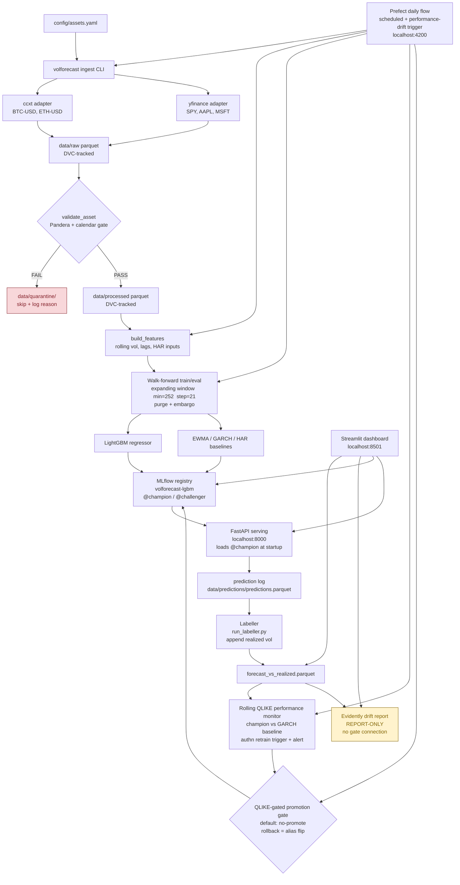

# VolForecast — Crypto + Stock Volatility Forecasting MLOps Platform

A short-horizon realized volatility forecasting system covering crypto (BTC, ETH) and
equities (SPY + large caps), wrapped in a full production MLOps lifecycle: ingestion,
validation, feature engineering, classical + ML models, serving, monitoring, drift
detection, and automated retraining.

**Portfolio goal:** Honestly benchmark an ML volatility model against the correct
classical baselines (GARCH(1,1)/EWMA) under leak-free walk-forward evaluation, inside
a genuine end-to-end MLOps lifecycle — every screening question ("deploy", "CI/CD for ML",
"drift + retraining", "feature engineering at scale") gets a repo-backed answer.

---

## Architecture



> **Note on drift:** The Evidently drift report (yellow node) is **report-only** — it
> surfaces feature distribution shifts for human review. It does NOT feed the promotion
> gate. The authoritative retrain trigger is rolling QLIKE degradation vs the GARCH
> baseline (the performance monitor node).

---

## How to run

### Prerequisites

- Docker Desktop 28+ with WSL2 backend (Windows 11) or Docker Engine (Linux/macOS)
- [uv](https://docs.astral.sh/uv/) package manager
- Git + [DVC](https://dvc.org/) (installed via `uv sync`)

### 1. Start the infrastructure stack

```bash
# Copy credentials template — set POSTGRES_PASSWORD before proceeding
# The stack refuses to start without it (no default password)
cp infra/.env.example infra/.env
# Edit infra/.env: set POSTGRES_PASSWORD=<your-password>

# Start all services: Postgres + MLflow + Prefect + API + Streamlit dashboard
docker compose -f infra/docker-compose.yml up -d
```

Service ports (all bound to 127.0.0.1 only — loopback-only, not LAN-exposed):

| Service | URL | Description |
|---------|-----|-------------|
| MLflow tracking + registry | http://localhost:5000 | Experiment runs, model versions, @champion alias |
| Prefect orchestration | http://localhost:4200 | DAG runs, schedules, flow run history |
| FastAPI inference | http://localhost:8000 | `/health`, `/forecast`, `/forecast/{symbol}` |
| Streamlit dashboard | http://localhost:8501 | Forecast vs realized, drift status, model version, service stats |
| Postgres | localhost:5433 | Host-side access only (MLflow + Prefect use port 5432 internally) |

> **Windows 11 note:** PostgreSQL binds to host port 5433 (not 5432) to avoid conflicts
> with other local Postgres instances. MLflow and Prefect communicate on port 5432 within
> the Docker network — this only affects host-side `psql` access.

Wait ~30 seconds for all services to become healthy, then verify:

```bash
docker compose -f infra/docker-compose.yml ps
# All services should show Status: Up (healthy)
```

### 2. First run: populate state for a working dashboard

The dashboard comes up in empty-state after a bare `docker compose up`. Run the following
sequence to populate all monitored artifacts so every panel shows real data.

```bash
# 1. Install Python dependencies
uv sync --dev

# 2. Ingest all 5 assets (2 crypto + 3 equity) from 2022-01-01 to today
uv run volforecast ingest --start 2022-01-01

# 3. Build the feature parquet from validated processed data
uv run python scripts/generate_features.py

# 4. Train LightGBM + log run to MLflow + register model as @champion
uv run python scripts/train_lgbm.py

# 5. Run walk-forward eval to regenerate reports/ml_vs_baselines.*
uv run python scripts/eval_lgbm.py

# 6. Exercise the API to write prediction-log rows
curl http://localhost:8000/forecast
# Or: uv run python -c "import httpx; print(httpx.get('http://localhost:8000/forecast').json())"

# 7. Build forecast_vs_realized.parquet (requires prediction-log rows from step 6)
uv run python scripts/run_labeller.py

# 8. Create the frozen drift reference snapshot
uv run python scripts/create_reference_snapshot.py

# 9. Register the Prefect daily deployment
uv run python scripts/create_deployment.py

# 10. Trigger the daily flow once (or let the schedule fire):
PREFECT_API_URL=http://localhost:4200/api \
  uv run prefect deployment run 'volforecast-daily/volforecast-daily'
```

Verify the dashboard at **http://localhost:8501** — all four panels should show real data.

### 3. Reproduce data at any commit (DVC)

```bash
# Restore data to the exact state recorded at the current commit
dvc checkout

# Or pull from remote cache (if configured)
dvc pull
```

Raw and processed datasets are DVC-tracked (`data/raw.dvc`, `data/processed.dvc`).
The `.dvc` pointer files are committed to git; actual parquet files are gitignored.

### 4. Tear down

```bash
docker compose -f infra/docker-compose.yml down
# Add -v to also remove named volumes (postgres_data, mlflow_artifacts)
```

---

## Development

### Run tests

```bash
# All tests (fixture-only, no live API calls)
uv run pytest tests/ -v

# Specific test file
uv run pytest tests/unit/test_pipeline.py -v
```

### Lint and format

```bash
uv run ruff check .          # lint
uv run ruff format --check . # format check
uv run ruff format .         # auto-format
```

### CI

Every push triggers GitHub Actions CI (`.github/workflows/ci.yml`):
- `ruff check .` — lint
- `ruff format --check .` — format check
- `pytest tests/ -x -q` with `VOLFORECAST_NO_LIVE_API=1` — fixture-only tests

No live API calls are permitted in CI.

---

## Tech Stack

| Component | Library/Version | Purpose |
|-----------|-----------------|---------|
| Ingestion | ccxt 4.5.x / yfinance 1.4.x | Crypto + equity OHLCV fetch |
| Validation | Pandera 0.31.x | Schema + calendar + OHLC gate |
| Calendar | exchange-calendars 4.13.x | NYSE session validation |
| Features | pandas 2.3.x / numpy 2.x | Rolling vol, lags, HAR inputs |
| Tracking | MLflow 3.13.0 | Experiment tracking + model registry (aliases, not stages) |
| Orchestration | Prefect 3.7.x | DAG scheduling + event-driven retrain |
| Backend | PostgreSQL 16 | MLflow + Prefect metadata store (named volumes, never NTFS bind mounts) |
| Data versioning | DVC 3.67.x | Parquet versioning alongside git |
| Models | arch (GARCH), LightGBM 4.6 | Classical baselines + ML regressor |
| Explainability | SHAP 0.52 | TreeExplainer for LightGBM feature importance |
| Serving | FastAPI 0.136.x | Real-time inference endpoint |
| Monitoring | Evidently 0.7.x | Distribution drift reports (report-only) |
| Dashboard | Streamlit 1.58 | Observability: forecast vs realized, drift, model version, service stats |
| CI/CD | GitHub Actions + uv | Lint + fixture-only tests on every push |

---

## Data

- **Raw:** `data/raw/crypto/BTC-USD.parquet`, `ETH-USD.parquet`; `data/raw/equity/SPY.parquet`, `AAPL.parquet`, `MSFT.parquet`
- **Processed:** `data/processed/` — validated subsets ready for feature engineering
- **Quarantine:** `data/quarantine/` — validation failures with row-level reasons
- **Features:** `data/features/` — rolling vol + lag features, HAR inputs
- **Predictions:** `data/predictions/predictions.parquet` — API prediction log
- **Monitoring:** `data/monitoring/forecast_vs_realized.parquet`, drift HTML reports
- All data directories are gitignored; DVC `.dvc` pointer files are committed

---

## What I learned

### Honest modeling finding

LightGBM improves on RMSE and MAE in many overall and low/mid-vol views — it produces
tighter point forecasts on typical days. But its **QLIKE is worse than the best classical
baseline for every single asset overall**, and catastrophically worse in high-volatility
regimes.

Concrete example from `reports/ml_vs_baselines.md`:

| Asset / regime | LightGBM QLIKE | Best classical QLIKE | Verdict |
|----------------|---------------|----------------------|---------|
| BTC-USD overall | 4.75 | HAR 1.92 | LightGBM loses by 2.83 |
| BTC-USD / vol-high | **11.50** | GARCH **0.68** | LightGBM loses by 10.82 |
| ETH-USD / vol-high | 13.88 | HAR 1.10 | LightGBM loses by 12.78 |
| AAPL / vol-high | 8.67 | HAR 0.97 | LightGBM loses by 7.70 |
| SPY overall | 2.69 | EWMA 1.63 | LightGBM loses by 1.06 |

**Why QLIKE matters here:** QLIKE (Quasi-Likelihood loss, Patton 2011 variance form) is
zero at a perfect forecast and penalizes under-forecasting of volatility spikes
disproportionately hard. A daily-horizon tree model trained on rolling-window features
smooths out spike structure — it produces well-calibrated forecasts on calm days, but
systematically under-forecasts realized variance during high-vol episodes. QLIKE catches
exactly that failure mode.

**The upshot:** At a daily horizon the classical baselines (GARCH, HAR, EWMA) remain the
bar to beat for variance loss. The project succeeds on the benchmarking objective either
way: the methodology is honest, the walk-forward evaluation is leak-free, and the finding
is reproducible from a single command. See [MODEL_CARD.md](MODEL_CARD.md) for the full
regime-segmented numbers.

### MLOps lessons

**Leak-free walk-forward evaluation with purge and embargo**
Random splits on time-series data leak future information into training. The evaluation
harness uses an expanding-window walk-forward with a minimum training window of 252 days,
a 21-day step, and a purge+embargo gap between the training tail and the test fold. Tercile
boundaries (low/mid/high vol) are computed on each test fold's own realized variance — no
lookahead into training data. `TimeSeriesSplit` alone is not sufficient for multi-asset
panels; the harness is custom and logged to MLflow.

**Alias-based MLflow registry instead of deprecated stages**
MLflow 2.9+ deprecated `transition_model_version_stage`. The correct pattern is model
version aliases (`@champion`, `@challenger`) combined with `validation_status` tags. The
FastAPI service loads the model via `models:/volforecast-lgbm@champion` URI at startup.
Rollback is a single alias-flip: point `@champion` at the previous version number. No
redeployment needed.

**Drift is report-only; rolling QLIKE is the real retrain trigger**
Evidently distribution drift reports surface feature shift for human review — they are
never wired into the promotion gate. The authoritative trigger for automated retraining is
rolling QLIKE degradation: when the champion's rolling QLIKE meaningfully exceeds the
GARCH baseline, the Prefect daily flow fires a retrain event. The distinction matters: a
feature distribution shift without performance degradation is not a retrain signal — it
could reflect a benign regime change that the current model already handles.

**QLIKE-gated champion/challenger promotion with default-no-promote**
The promotion gate requires the challenger QLIKE to be strictly better than the champion
QLIKE by a configured margin. Default disposition is no-promote (the challenger must earn
promotion). This is safer than promote-by-default because a challenger trained on a short
tail of high-vol data will often win on RMSE but lose on QLIKE — which is the scenario
where it should not be promoted.

**Windows + Docker production gotchas**
- Do NOT use SQLite on a Windows bind-mount as the MLflow or Prefect backend store.
  SQLite file locking over the WSL2/NTFS boundary causes `database is locked` corruption.
  Use a Postgres container with named volumes (`postgres_data`, `mlflow_artifacts`).
- LightGBM on Docker `python:3.12-slim` images requires `libgomp1` installed via
  `apt-get` — the OpenMP runtime is not bundled in slim images, and the error message
  at import time is not obvious.
- Add `.gitattributes` with `*.sh text eol=lf`. CRLF line endings in Docker entrypoint
  scripts are the most common "works on Windows, dies in the container" failure.
- All services bind to `127.0.0.1` only. On Windows, Docker Desktop forwards published
  ports through the host firewall, so a plain `5000:5000` binding would expose
  unauthenticated services (MLflow has no auth) to the LAN.

---

## License

MIT
