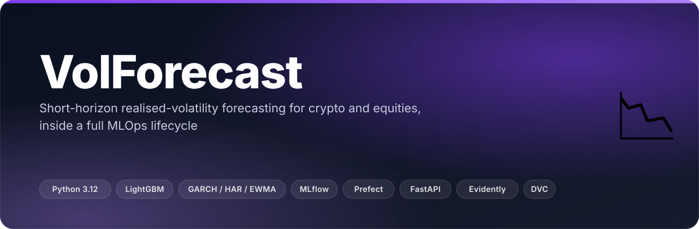
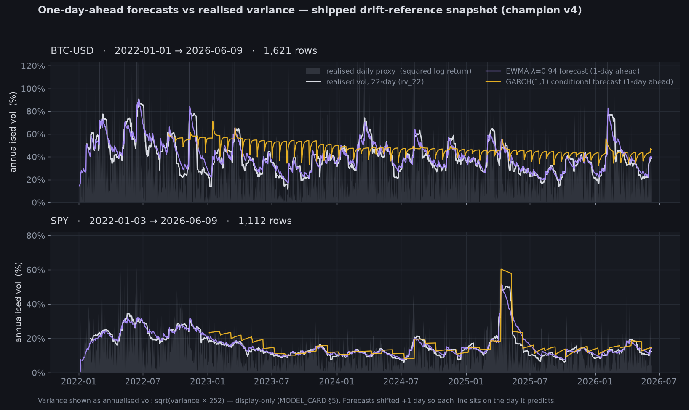
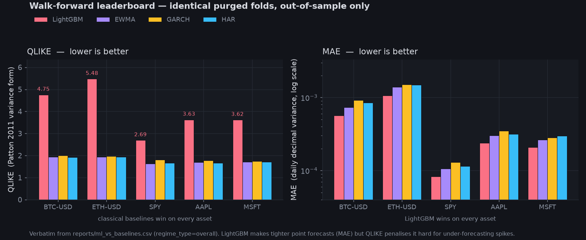
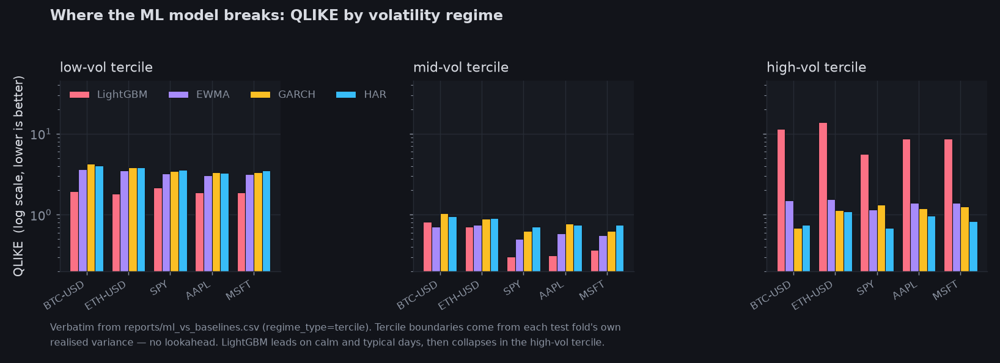
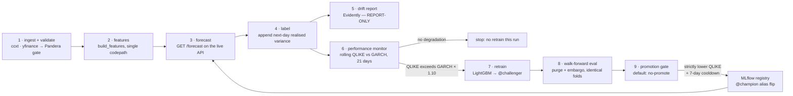
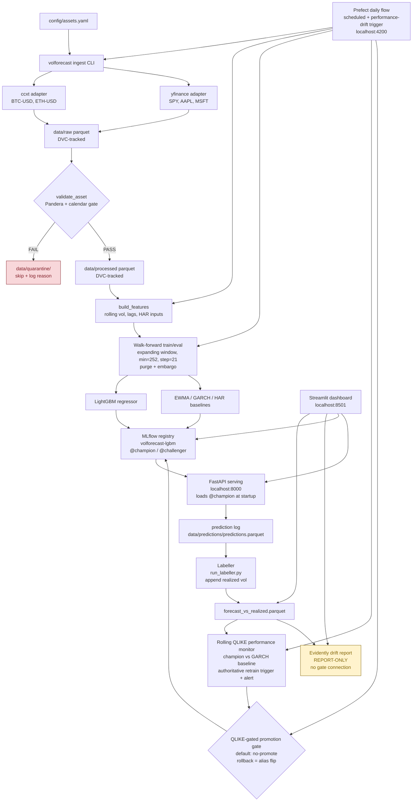

<p align="center"></p>

<p align="center">
  <b>An ML volatility model, benchmarked honestly against GARCH / HAR / EWMA under leak-free walk-forward evaluation — and the answer is that the classical baselines still win.</b>
</p>

<p align="center">
  <a href="https://github.com/ChinmayGit8765/VolatilityModel/actions/workflows/ci.yml"></a>
  
  
  
  
</p>

A short-horizon realized volatility forecasting system covering crypto (BTC, ETH) and
equities (SPY + large caps), wrapped in a full production MLOps lifecycle: ingestion,
validation, feature engineering, classical + ML models, serving, monitoring, drift
detection, and automated retraining.

**Portfolio goal:** honestly benchmark an ML volatility model against the correct
classical baselines (GARCH(1,1)/EWMA/HAR-RV) under leak-free walk-forward evaluation, inside
a genuine end-to-end MLOps lifecycle — every screening question ("deploy", "CI/CD for ML",
"drift + retraining", "feature engineering at scale") gets a repo-backed answer.

> It is a volatility **forecasting** and ML-systems demo. It is **not** a trading strategy,
> not price-direction prediction, and not intended for live risk decisions
> ([MODEL_CARD.md §2](MODEL_CARD.md)).

---

## ✨ What it does

- **Ingests five assets from free APIs** — BTC/USDT + ETH/USDT via ccxt/Binance, SPY + AAPL + MSFT
  via yfinance — through a Pandera schema + exchange-calendar gate; failures land in
  `data/quarantine/` with a row-level reason instead of poisoning the pipeline.
- **Builds one feature matrix, used by both training and serving** (`features/pipeline.py` is the
  only implementation): multi-lookback realized variance (`rv_5/10/22/66`), EWMA variance,
  a walk-forward-filtered GARCH(1,1) conditional variance, Parkinson and Garman–Klass range
  estimators, vol-of-vol, rolling skew/kurtosis, calendar flags, and cross-asset RV joined with a
  3-calendar-day staleness cap.
- **Scores LightGBM against three classical baselines on identical purged folds** — expanding
  window, `min_train=252`, `step=21`, purge + embargo, terciles computed on each test fold's own
  realized variance. No random splits anywhere.
- **Serves the registry champion over FastAPI** — `models:/volforecast-lgbm@champion` is loaded at
  startup; rollback is a single alias flip, no redeploy.
- **Closes the loop automatically** — every forecast is logged, labelled with next-day realized
  variance, and monitored: rolling QLIKE vs the GARCH baseline is the retrain trigger, and a
  QLIKE promotion gate (default **no-promote**) decides whether a challenger ever becomes champion.
- **Reports the result even when the result is unflattering** — see below.

## 🎬 See it



<sub><b>Real data, shipped in this repo.</b> Realised variance and both classical one-day-ahead
forecasts, plotted from the frozen Evidently drift-reference snapshot for champion v4
(<code>data/monitoring/reference/4_reference.parquet</code>, 2022-01 → 2026-06). Forecasts are
shifted +1 day so each line sits on the day it predicts, matching the harness alignment
(<code>models/*.py :: forecast_path</code>). Variance is displayed as annualised vol —
<code>sqrt(var × 252)</code> — which <a href="MODEL_CARD.md">MODEL_CARD.md §5</a> allows as a
display-only transform. The sawtooth in the GARCH line is real: it is refitted monthly and holds
its parameters in between.</sub>

<table><tr>
<td width="50%"><br><sub><b>The whole finding in one picture.</b> Walk-forward leaderboard, straight from <code>reports/ml_vs_baselines.csv</code>: LightGBM has the lowest MAE on all five assets and the worst QLIKE on all five.</sub></td>
<td width="50%"><br><sub><b>Where it breaks.</b> Same CSV, split by volatility tercile. LightGBM leads QLIKE in the low-vol tercile on all five assets and in the mid-vol tercile on four of five (EWMA edges it on BTC-USD) — then collapses in the high-vol tercile.</sub></td>
</tr></table>

There is also a Streamlit observability dashboard (`src/volforecast/dashboard/app.py`,
`localhost:8501`) with four panels — forecast vs realized, distribution-drift status, live champion
model version, and service stats. It needs the full compose stack plus a populated run, so it is
not screenshotted here; the [quick start](#-quick-start) brings it up.

## 📉 The honest finding

LightGBM improves on RMSE and MAE in many overall and low/mid-vol views — it produces tighter point
forecasts on typical days. But its **QLIKE is worse than the best classical baseline for every
single asset overall**, and catastrophically worse in high-volatility regimes.

All numbers below are from `reports/ml_vs_baselines.md` (walk-forward, identical test folds).

| Asset / regime | LightGBM QLIKE | Best classical QLIKE | Worst-case margin |
|----------------|---------------|----------------------|-------------------|
| AAPL overall | 3.63 | HAR 1.67 | +1.96 |
| BTC-USD overall | 4.75 | HAR 1.92 | +2.83 |
| ETH-USD overall | 5.48 | EWMA 1.93 | +3.54 |
| MSFT overall | 3.62 | HAR 1.70 | +1.91 |
| SPY overall | 2.69 | EWMA 1.63 | +1.06 |
| AAPL / vol-high | 8.67 | HAR 0.97 | +7.70 |
| BTC-USD / vol-high | **11.50** | GARCH **0.68** | **+10.82** |
| ETH-USD / vol-high | 13.88 | HAR 1.10 | +12.78 |
| MSFT / vol-high | 8.61 | HAR 0.83 | +7.77 |
| SPY / vol-high | 5.60 | HAR 0.69 | +4.91 |

**Where LightGBM wins:** in low- and mid-vol terciles LightGBM dominates on RMSE and MAE
(e.g. BTC-USD / vol-low: LightGBM RMSE 1.08e-4 vs EWMA 6.16e-4). It is better at
point-forecasting typical daily variance — the tree model learns cross-asset structure and
lag patterns that the univariate GARCH/EWMA cannot exploit.

**Why QLIKE matters here:** QLIKE (Quasi-Likelihood loss, Patton 2011 variance form) is
zero at a perfect forecast and penalizes under-forecasting of volatility spikes
disproportionately hard. A daily-horizon tree model trained on rolling-window features
smooths out spike structure — it produces well-calibrated forecasts on calm days, but
systematically under-forecasts realized variance during high-vol episodes. QLIKE catches
exactly that failure mode, and it is the loss function used in the promotion gate.

**The upshot:** at a daily horizon the classical baselines (GARCH, HAR, EWMA) remain the
bar to beat for variance loss. The project succeeds on the benchmarking objective either
way: the methodology is honest, the walk-forward evaluation is leak-free, and the finding
is reproducible from a single command. See [MODEL_CARD.md](MODEL_CARD.md) for the full
regime-segmented numbers.

<details>
<summary><b>Baseline-only metrics (EWMA vs GARCH(1,1) vs HAR-RV, per asset)</b></summary>

From `reports/baseline_metrics.csv` — daily decimal variance units, walk-forward test indices only.
GARCH fallbacks (previous-window params → EWMA) were **0** for every asset.

| Asset | Model | N | RMSE | MAE | QLIKE |
|-------|-------|---|------|-----|-------|
| BTC-USD | EWMA | 1,344 | 1.544555e-03 | 7.364814e-04 | 1.950012 |
| BTC-USD | GARCH | 1,344 | 1.577425e-03 | 9.219698e-04 | 2.003164 |
| BTC-USD | HAR | 1,344 | 1.533963e-03 | 8.495577e-04 | 1.930656 |
| ETH-USD | EWMA | 1,344 | 2.962131e-03 | 1.390028e-03 | 1.934222 |
| ETH-USD | GARCH | 1,344 | 2.998875e-03 | 1.503271e-03 | 1.960759 |
| ETH-USD | HAR | 1,344 | 2.978026e-03 | 1.492694e-03 | 1.936323 |
| SPY | EWMA | 818 | 3.949478e-04 | 1.064168e-04 | 1.634448 |
| SPY | GARCH | 818 | 4.382480e-04 | 1.294589e-04 | 1.805021 |
| SPY | HAR | 818 | 3.923679e-04 | 1.152374e-04 | 1.657546 |
| AAPL | EWMA | 817 | 8.930383e-04 | 3.003930e-04 | 1.688206 |
| AAPL | GARCH | 817 | 9.437992e-04 | 3.481800e-04 | 1.772407 |
| AAPL | HAR | 817 | 8.944729e-04 | 3.172831e-04 | 1.666804 |
| MSFT | EWMA | 819 | 6.601060e-04 | 2.635338e-04 | 1.712161 |
| MSFT | GARCH | 819 | 6.654619e-04 | 2.804379e-04 | 1.745235 |
| MSFT | HAR | 819 | 6.611853e-04 | 2.968209e-04 | 1.703623 |

Protocol notes carried from `reports/baseline_eval.md`: EWMA λ = 0.94 (RiskMetrics daily);
GARCH(1,1) fitted on 100× scaled returns with `rescale=False`, refitted monthly;
HAR-RV = Corsi (2009) OLS on `rv_d` / 5-day mean / 22-day mean, refitted monthly.
Zero-target rows (identical consecutive closes — a yfinance adjusted-close artifact) are dropped
before scoring, because a zero realized variance makes QLIKE `+inf` via `log(0)`.

</details>

## 🧠 How it works

The Prefect daily flow, exactly as wired in `pipelines/daily_pipeline.py`:



> **Note on drift:** the Evidently drift report is **report-only** — it surfaces feature
> distribution shifts for human review. It does **not** feed the promotion gate. The authoritative
> retrain trigger is rolling QLIKE degradation vs the GARCH baseline
> (`monitoring/performance.py`: `PERF_WINDOW = 21`, `DEGRADATION_THRESHOLD = 0.10`).

A walk-through of one day: the ingest CLI pulls OHLCV cache-first and validates it (a data-quality
failure is a hard pipeline fail, never a silent skip). `build_features` writes the per-asset feature
parquet. The flow then calls the real serving endpoint rather than predicting in-process, so the
champion-load path, the single feature codepath and the prediction log are all exercised end to end
— a dead serving layer fails the flow loudly. The labeller joins yesterday's forecasts to realized
variance (idempotent, deduped on a label key), the drift report is written for humans, and the
performance monitor decides whether today earns a retrain. If it does, the fresh model is
registered and *immediately* demoted to `@challenger` so the promotion gate stays the only path to
`@champion`.

<details>
<summary><b>Full component architecture (all services, data stores and failure paths)</b></summary>



</details>

## 🚀 Quick start

**Prerequisites:** Docker Desktop 28+ with the WSL2 backend (Windows 11) or Docker Engine
(Linux/macOS) · [uv](https://docs.astral.sh/uv/) · Git + [DVC](https://dvc.org/) (installed by
`uv sync`).

```bash
# 1. Credentials — the stack refuses to start without a password (no default)
cp infra/.env.example infra/.env        # then set POSTGRES_PASSWORD=<your-password>

# 2. Postgres + MLflow + Prefect + FastAPI + Streamlit
docker compose -f infra/docker-compose.yml up -d

# 3. Python deps, then the shortest useful path: ingest → features → train → eval
uv sync --dev
uv run volforecast ingest --start 2022-01-01
uv run python scripts/generate_features.py
uv run python scripts/train_lgbm.py      # logs the run + registers @champion
uv run python scripts/eval_lgbm.py       # regenerates reports/ml_vs_baselines.*
```

| Service | URL | What is there |
|---------|-----|---------------|
| MLflow tracking + registry | http://localhost:5000 | Experiment runs, model versions, `@champion` alias |
| Prefect orchestration | http://localhost:4200 | DAG runs, schedules, flow run history |
| FastAPI inference | http://localhost:8000 | `/health`, `/forecast`, `/forecast/{symbol}` |
| Streamlit dashboard | http://localhost:8501 | Forecast vs realized, drift status, model version, service stats |
| Postgres | localhost:5433 | Host-side access only (MLflow + Prefect use 5432 inside the network) |

All ports are bound to `127.0.0.1` only — loopback, not LAN-exposed.

<details>
<summary><b>Full first-run sequence (populate every dashboard panel)</b></summary>

The dashboard comes up in empty-state after a bare `docker compose up`. Run the following
sequence to populate all monitored artifacts so every panel shows real data.

```bash
# 1. Install Python dependencies
uv sync --dev

# 2. Ingest all 5 assets (2 crypto + 3 equity) from 2022-01-01 to today
uv run volforecast ingest --start 2022-01-01

# 3. Build the feature parquet from validated processed data
uv run python scripts/generate_features.py

# 4. Train LightGBM + log run to MLflow + register model as @champion
uv run python scripts/train_lgbm.py

# 5. Run walk-forward eval to regenerate reports/ml_vs_baselines.*
uv run python scripts/eval_lgbm.py

# 6. Exercise the API to write prediction-log rows
curl http://localhost:8000/forecast
# Or: uv run python -c "import httpx; print(httpx.get('http://localhost:8000/forecast').json())"

# 7. Build forecast_vs_realized.parquet (requires prediction-log rows from step 6)
uv run python scripts/run_labeller.py

# 8. Create the frozen drift reference snapshot
uv run python scripts/create_reference_snapshot.py

# 9. Register the Prefect daily deployment
uv run python scripts/create_deployment.py

# 10. Trigger the daily flow once (or let the schedule fire):
PREFECT_API_URL=http://localhost:4200/api \
  uv run prefect deployment run 'volforecast-daily/volforecast-daily'
```

Verify the dashboard at **http://localhost:8501** — all four panels should show real data.

Wait ~30 seconds after `up -d` for services to become healthy, then check:

```bash
docker compose -f infra/docker-compose.yml ps
# All services should show Status: Up (healthy)
```

> **Windows 11 note:** PostgreSQL binds to host port 5433 (not 5432) to avoid conflicts
> with other local Postgres instances. MLflow and Prefect communicate on port 5432 within
> the Docker network — this only affects host-side `psql` access.

`/forecast` takes ~40–60 s per call because GARCH-as-a-feature is computed on the request path;
the orchestration task allows a 300 s timeout for it.

**Tear down**

```bash
docker compose -f infra/docker-compose.yml down
# Add -v to also remove named volumes (postgres_data, mlflow_artifacts)
```

</details>

<details>
<summary><b>Reproducing data at any commit (DVC), tests, lint and CI</b></summary>

**Data**

```bash
dvc checkout   # restore data to the exact state recorded at the current commit
dvc pull       # or pull from a remote cache, if configured
```

Raw and processed datasets are DVC-tracked (`data/raw.dvc`, `data/processed.dvc`,
`data/features.dvc`). The `.dvc` pointer files are committed to git; the actual parquet files are
gitignored.

- **Raw:** `data/raw/crypto/BTC-USD.parquet`, `ETH-USD.parquet`; `data/raw/equity/SPY.parquet`, `AAPL.parquet`, `MSFT.parquet`
- **Processed:** `data/processed/` — validated subsets ready for feature engineering
- **Quarantine:** `data/quarantine/` — validation failures with row-level reasons
- **Features:** `data/features/` — rolling vol + lag features, HAR inputs
- **Predictions:** `data/predictions/predictions.parquet` — API prediction log
- **Monitoring:** `data/monitoring/forecast_vs_realized.parquet`, drift HTML reports, and the frozen
  `data/monitoring/reference/<version>_reference.parquet` snapshots used by this README's plots

**Tests and lint**

```bash
uv run pytest tests/ -v                 # 472 test functions, fixture-only, no live API calls
uv run pytest tests/unit/test_pipeline.py -v
uv run ruff check .                     # lint
uv run ruff format --check .            # format check
```

**CI** — every push and pull request triggers GitHub Actions (`.github/workflows/ci.yml`):
`ruff check .` → `ruff format --check .` → `pytest tests/ -x -q` with
`VOLFORECAST_NO_LIVE_API=1`. No live API calls are permitted in CI.

</details>

## 🗂️ Project layout

```
src/volforecast/
  ingest/      ccxt + yfinance adapters, cache-first, CLI entrypoint
  validate/    Pandera schemas + calendar/OHLC gate → quarantine on fail
  features/    pipeline.py (THE feature codepath), estimators, target, cross_asset
  models/      ewma · garch · har_rv (each a forecast_path) + lgbm (pooled train, grid search, SHAP)
  eval/        walk-forward harness, QLIKE/RMSE/MAE metrics, regime terciles
  serving/     FastAPI app (@champion at startup) + prediction log
  monitoring/  drift (report-only) · performance (retrain trigger) · promotion · labeller · alerts
  dashboard/   Streamlit observability app (4 panels)
pipelines/     daily_pipeline.py — the Prefect flow above
scripts/       generate_features · train_lgbm · eval_lgbm · run_labeller · create_* (thin CLIs)
config/        assets.yaml — the asset universe
infra/         docker-compose.yml + per-service Dockerfiles + postgres init
reports/       baseline_eval.md · ml_vs_baselines.{md,csv} — generated evaluation output
tests/         unit · integration · smoke (fixture-only)
```

## 🧰 Stack

| Layer | Choice | Why |
|-------|--------|-----|
| Models | LightGBM 4.6 · arch (GARCH) · statsmodels (HAR) | Fast CPU tabular baseline vs the reference implementations of the classical models |
| Features & data | pandas 2.3 / numpy 2 / pyarrow | `mlflow<4` pins `pandas<3`; parquet everywhere |
| Validation | Pandera 0.31 + exchange-calendars | Schema-as-code gate that is pytest-able and Prefect-task-friendly |
| Registry | MLflow 3.13, **aliases not stages** | `transition_model_version_stage` is deprecated; `@champion`/`@challenger` + tags is the current pattern |
| Orchestration | Prefect 3.7 (server + worker in containers) | Lighter than Airflow to self-host; native event-driven retrain |
| Serving | FastAPI 0.136 + uvicorn | Explicit request/response schemas and a model-info surface, instead of `mlflow models serve` |
| Monitoring | Evidently 0.7 (report-only) + custom rolling-QLIKE monitor | Distribution drift is for humans; performance loss is the trigger |
| Platform | Docker Compose + PostgreSQL 16 + DVC 3.67 + GitHub Actions + uv | One Postgres backs MLflow and Prefect; data versioned beside git; lint + fixture tests on every push |

<details>
<summary><b>Full component/version table</b></summary>

| Component | Library/Version | Purpose |
|-----------|-----------------|---------|
| Ingestion | ccxt 4.5.x / yfinance 1.4.x | Crypto + equity OHLCV fetch |
| Validation | Pandera 0.31.x | Schema + calendar + OHLC gate |
| Calendar | exchange-calendars 4.13.x | NYSE session validation |
| Features | pandas 2.3.x / numpy 2.x | Rolling vol, lags, HAR inputs |
| Tracking | MLflow 3.13.0 | Experiment tracking + model registry (aliases, not stages) |
| Orchestration | Prefect 3.7.x | DAG scheduling + event-driven retrain |
| Backend | PostgreSQL 16 | MLflow + Prefect metadata store (named volumes, never NTFS bind mounts) |
| Data versioning | DVC 3.67.x | Parquet versioning alongside git |
| Models | arch (GARCH), LightGBM 4.6 | Classical baselines + ML regressor |
| Explainability | SHAP 0.52 | TreeExplainer for LightGBM feature importance |
| Serving | FastAPI 0.136.x | Real-time inference endpoint |
| Monitoring | Evidently 0.7.x | Distribution drift reports (report-only) |
| Dashboard | Streamlit 1.58 | Observability: forecast vs realized, drift, model version, service stats |
| CI/CD | GitHub Actions + uv | Lint + fixture-only tests on every push |

</details>

## 🗺️ Status

✅ **v1.0 shipped** (tag `v1.0`) — 5 phases, 20 plans, CI green, milestone audit passed with all
35 requirements complete. The loop runs end to end: ingest → validate → features → serve → label →
monitor → retrain → gate.

🚧 **Report-only by design** — Evidently drift never gates promotion; only rolling QLIKE does.

🔜 **Known v2 work**, carried verbatim from [MODEL_CARD.md §10](MODEL_CARD.md):

- **QLIKE weakness in high-vol regimes** is the primary limitation. Where under-forecasting large
  variance is expensive (options pricing, risk management), GARCH or HAR is the appropriate model.
- **Promotion cooldown is not persisted across Prefect runs** — it is recomputed from the registry
  each run, so two runs close together could double-promote. The fix is a durable
  "last promoted" registry tag.
- **No true high-frequency realized variance** — the proxy is close-to-close squared log returns;
  intraday RV is a stretch goal.
- **Single-exchange crypto data** (Binance via ccxt) — geo/cloud-IP blocked in places; switching to
  Kraken or Coinbase is a one-line config change.
- **Free-data quality** — yfinance is best-effort Yahoo; DVC caching isolates reruns from Yahoo
  downtime but not from historical artifacts.
- **No explicit cross-asset correlation structure** in the model itself, beyond as-of-joined
  cross-asset RV features.

## 🧪 What I learned

**Leak-free walk-forward evaluation with purge and embargo.** Random splits on time-series data
leak future information into training. The harness uses an expanding-window walk-forward with
`min_train=252`, `step=21`, and a purge+embargo gap between the training tail and the test fold.
Tercile boundaries are computed on each test fold's own realized variance — no lookahead into
training data. `TimeSeriesSplit` alone is not sufficient for multi-asset panels; the harness is
custom and logged to MLflow.

**Alias-based MLflow registry instead of deprecated stages.** MLflow 2.9+ deprecated
`transition_model_version_stage`. The correct pattern is model version aliases
(`@champion`, `@challenger`) combined with `validation_status` tags. The FastAPI service loads the
model via `models:/volforecast-lgbm@champion` at startup, so rollback is a single alias flip to the
previous version number — no redeployment.

**Drift is report-only; rolling QLIKE is the real retrain trigger.** A feature distribution shift
without performance degradation is not a retrain signal — it could be a benign regime change the
current model already handles. So Evidently reports are written for humans, and the authoritative
trigger is the champion's rolling QLIKE exceeding the GARCH baseline by 10% over 21 days.

**QLIKE-gated promotion with default-no-promote.** A challenger must strictly improve QLIKE on a
frozen comparison window, with a 7-day cooldown between promotions; anything else is a no-promote.
This is safer than promote-by-default because a challenger trained on a short tail of high-vol data
will often win on RMSE and lose on QLIKE — exactly the case where it must not be promoted.

**Forecasts must come from the real serving path.** The daily flow originally never called
`/forecast`, so the labeller had nothing to label and the whole feedback loop was a silent no-op
that still reported success. The milestone audit caught it. The flow now hits the live API between
features and labelling, and a dead serving layer fails the run loudly.

<details>
<summary><b>Windows + Docker production gotchas (hard-won)</b></summary>

- Do NOT use SQLite on a Windows bind-mount as the MLflow or Prefect backend store.
  SQLite file locking over the WSL2/NTFS boundary causes `database is locked` corruption.
  Use a Postgres container with named volumes (`postgres_data`, `mlflow_artifacts`).
- LightGBM on Docker `python:3.12-slim` images requires `libgomp1` installed via
  `apt-get` — the OpenMP runtime is not bundled in slim images, and the error message
  at import time is not obvious.
- Add `.gitattributes` with `*.sh text eol=lf`. CRLF line endings in Docker entrypoint
  scripts are the most common "works on Windows, dies in the container" failure.
- All services bind to `127.0.0.1` only. On Windows, Docker Desktop forwards published
  ports through the host firewall, so a plain `5000:5000` binding would expose
  unauthenticated services (MLflow has no auth) to the LAN.

</details>

## 📄 License

MIT — as declared here; no `LICENSE` file is committed to the repo yet.

<p align="center"><sub>Built by <a href="https://github.com/ChinmayGit8765">Chinmay</a> · part of the <a href="https://chinmaygit8765.github.io/exaryn-studio/">Exaryn</a> studio</sub></p>
